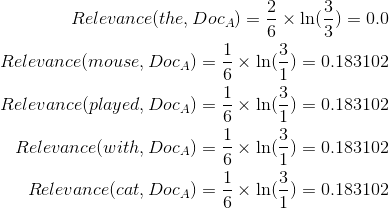

### Goal 

Implement TF-IDF score for each word in each document.

#### TF-IDF equation


### Example

Given the following 3 documents ([example source](https://courses.cs.washington.edu/courses/cse373/17au/project3/project3-2.html)):
* Document A: "the mouse played with the cat"
* Document B: "the quick brown fox jumped over the lazy dog"
* Document C: "dog 1 and dog 2 ate the hot dog"

Then the TF-IDF scores for all words in Document A would be calculated as: 


Your class should work something like:

```Java 
    myIndex.tfidfScore("mouse", "a.txt")
```

